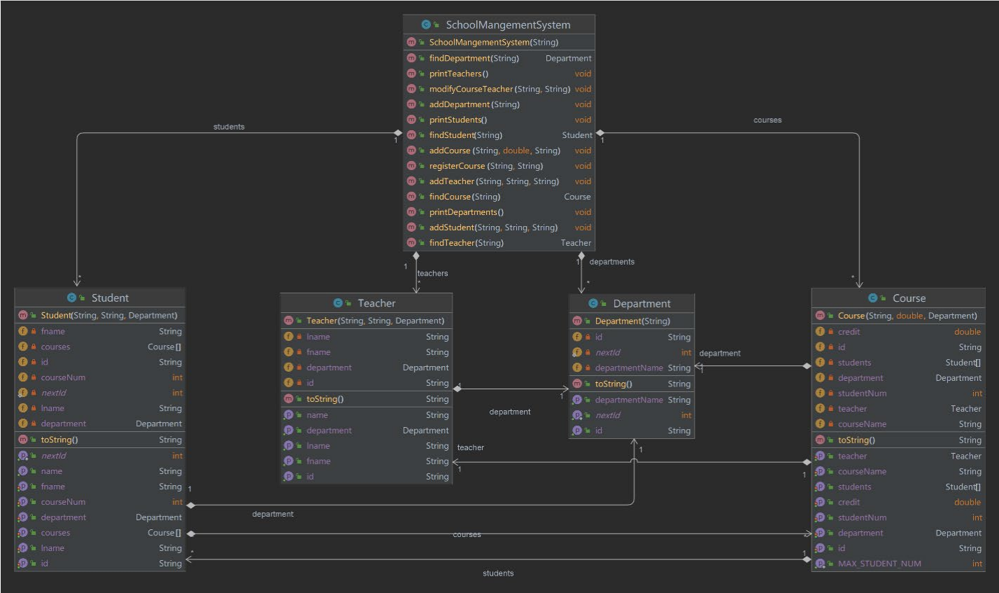

# 
SchoolManagementSystem

## 
Final Project for Introduction to Programming Course

### Project Overview

The School Management System provides functionalities to manage departments, students, teachers, and courses
within a school. It supports operations such as adding new members, displaying information,
searching for members, assigning teachers to courses, and registering courses for students.
### Diagram of the SchoolManagementSystem

### Contributors
Hamza Khalid